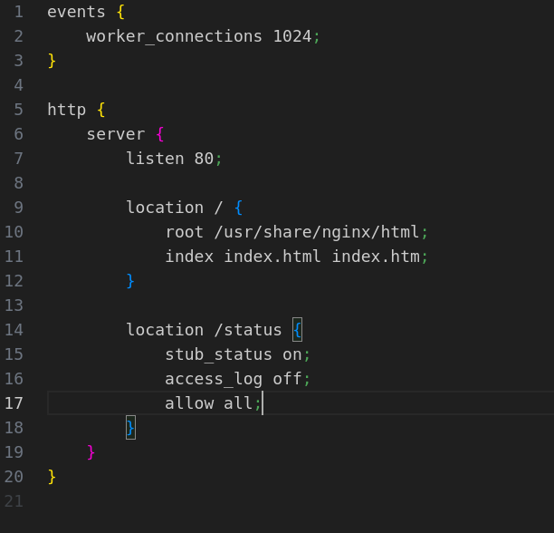

# Part 1

01. `docker pull nginx`  

02. `docker contents`  

03. `docker run -d --name voicerol-nginx nginx`  

04. `docker ps` (ps like "Process Status")  

05. `docker inspect`

06. `docker stop`  

07. `docker ps` after having the container stopped  

08. `docker run -d -p 80:80 -p 443:443 --name voicerol-nginx2 nginx`  

09. `nginx2 testing localhost:80`  

# Part 2

01. `docker exec voicerol-nginx cat`

02. creating nginx configuration in local machine

03. copying conf file on container

04. reload nginx-conf in container

05. testing `localhost:80/status`

06. export container usage

# Part 3

01. Wrote mini server on C

02. Wrote own nginx file which will be proxing all request from 81 port in `127.0.0.1:8080`

03. Testing web-server in terminal & browser
- terminal:

- browser: 

# Part 4
01. Docker image

02. Port 8080

03. Builder file

04. nginx configurator

05. server & status 

# Part 5
01. ALL ERRORS

02. Fixed result

# Part 6

- See in `src/contents/part6`
